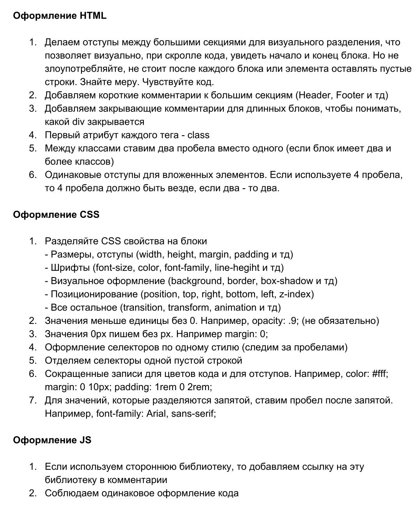
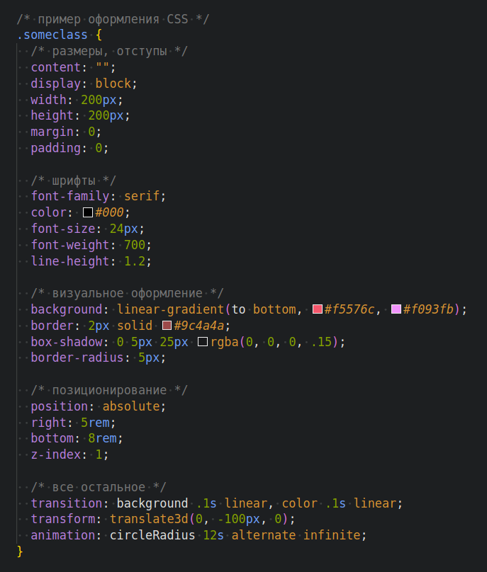
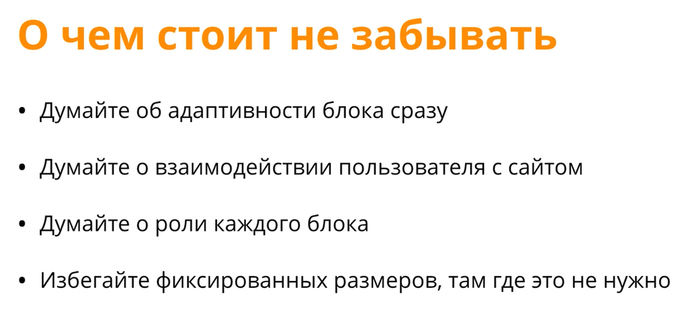
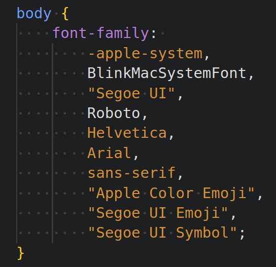

# JS
Different temporary projects.

## BEM
BEM methodology, coding style, project structure, PageSpeed Insights, advices from BrainsCloud.

PageSpeed Insights [pagespeed.web.dev](https://pagespeed.web.dev/).

[Checklist](BEM/data/checklist.pdf).



```css
/* пример оформления CSS */
.someclass {
  /* размеры, отступы */
  content: "";
  display: block;
  width: 200px;
  height: 200px;
  margin: 0;
  padding: 0;

  /* шрифты */
  font-family: serif;
  color: #000;
  font-size: 24px;
  font-weight: 700;
  line-height: 1.2;

  /* визуальное оформление */
  background: linear-gradient(to bottom, #f5576c, #f093fb);
  border: 2px solid #9c4a4a;
  box-shadow: 0 5px 25px rgba(0, 0, 0, .15);
  border-radius: 5px;

  /* позиционирование */
  position: absolute;
  right: 5rem;
  bottom: 8rem;
  z-index: 1;

  /* все остальное */
  transition: background .1s linear, color .1s linear;
  transform: translate3d(0, -100px, 0);
  animation: circleRadius 12s alternate infinite;
}
```





## systemFonts
Animations and system fonts from BrainsCloud.


